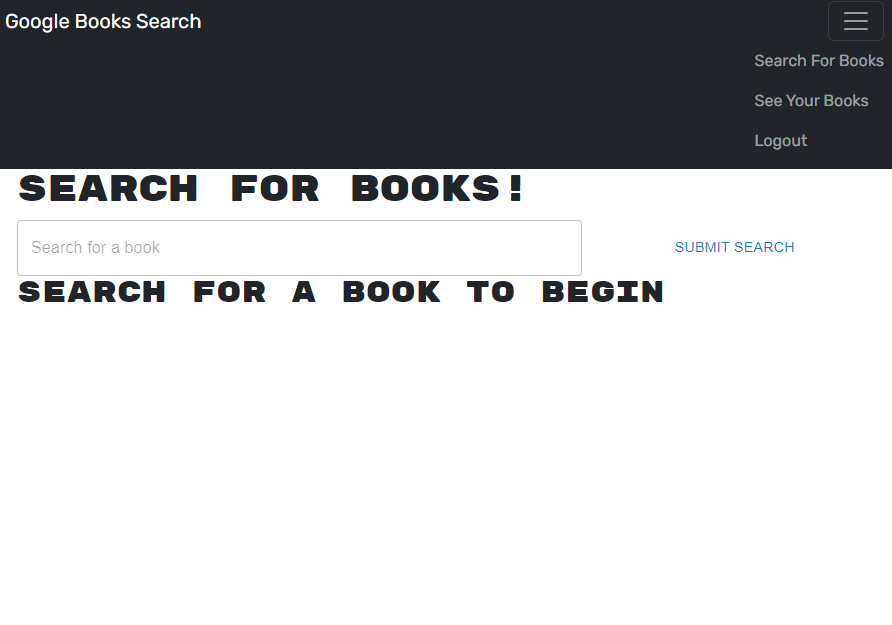

# booksearch-engine

## Contents
- [Description](#description)
- [User Story](#user-story)
- [Installation](#installation)
- [Usage](#usage)
- [Resources & Credit](#resourcescredit)
- [Images](#images)

## Description
The Book Search Engine utilizes the Google Book Search API. Users can search for books, login and logout, save books to their profiles, and also remove books from their profiles. 

### User Story
AS AN avid reader<br>
I WANT to search for new books to read<br>
SO THAT I can keep a list of books to purchase<br>

GIVEN a book search engine<br>
WHEN I load the search engine<br>
THEN I am presented with a menu with the options Search for Books and Login/Signup and an input field to search for books and a submit button<br>
WHEN I click on the Search for Books menu option<br>
THEN I am presented with an input field to search for books and a submit button<br>
WHEN I am not logged in and enter a search term in the input field and click the submit button<br>
THEN I am presented with several search results, each featuring a book’s title, author, description, image, and a link to that book on the Google Books site<br>
WHEN I click on the Login/Signup menu option<br>
THEN a modal appears on the screen with a toggle between the option to log in or sign up<br>
WHEN the toggle is set to Signup<br>
THEN I am presented with three inputs for a username, an email address, and a password, and a signup button<br>
WHEN the toggle is set to Login<br>
THEN I am presented with two inputs for an email address and a password and login button<br>
WHEN I enter a valid email address and create a password and click on the signup button<br>
THEN my user account is created and I am logged in to the site<br>
WHEN I enter my account’s email address and password and click on the login button<br>
THEN I the modal closes and I am logged in to the site<br>
WHEN I am logged in to the site<br>
THEN the menu options change to Search for Books, an option to see my saved books, and Logout<br>
WHEN I am logged in and enter a search term in the input field and click the submit button<br>
THEN I am presented with several search results, each featuring a book’s title, author, description, image, and a link to that book on the Google Books site and a button to save a book to my account<br>
WHEN I click on the Save button on a book<br>
THEN that book’s information is saved to my account<br>
WHEN I click on the option to see my saved books<br>
THEN I am presented with all of the books I have saved to my account, each featuring the book’s title, author, description, image, and a link to that book on the Google Books site and a button to remove a book from my account<br>
WHEN I click on the Remove button on a book<br>
THEN that book is deleted from my saved books list<br>
WHEN I click on the Logout button<br>
THEN I am logged out of the site and presented with a menu with the options Search for Books and Login/Signup and an input field to search for books and a submit button<br>

## Installation
1. Clone the repository: 
```bash
git clone git@github.com:Jsterling56/booksearch-engine.git
```

2. Navigate to the directory:
```bash
cd booksearch-engine
```

3. Install dependencies:
```bash
npm install
```

4. Set up Environment Variables:
```bash
booksearch-engine_API_KEY = <your-api-key-here>
booksearch-engine_GRAPHQL_ENDPOINT = <your-graphql-endpoint-here>
```

5. Start the development Server:
```bash
npm run develop
```

6. Open the Application:
Once the development server is running, you can access the app by opening your web browser and navigating to http://localhost:3000

## Usage
Technologies used for this project:
 - React
 - React Router
 - Apollo Client
 - Node.js
 - Express
 - GraphQL

## Resources/Credit
This project could not have been finished without the help of my tutor, Robby Kurle. The dude is a legend. 
Also huge shout outs to Sergio, Tim, and Brandon.
ChatGPT was used for debugging purposes only.

Links referenced:
React documentation - 
(https://react.dev/reference/react)

ReactRouter documentation - 
(https://reactrouter.com/en/main/start/faq) 

GraphQL documentation - 
(https://graphql.org/learn/) 

MongoDB Atlas Documentation - 
(https://www.mongodb.com/docs/) 

## License 
This project is licensed under the MIT License.

## Image
